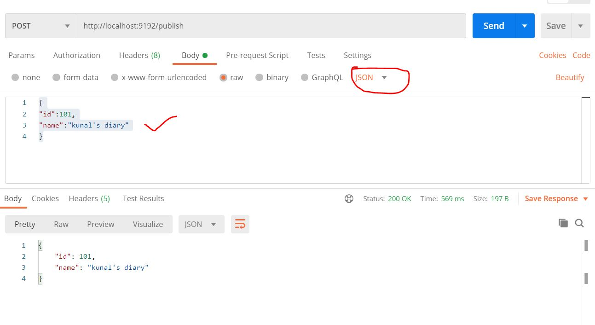
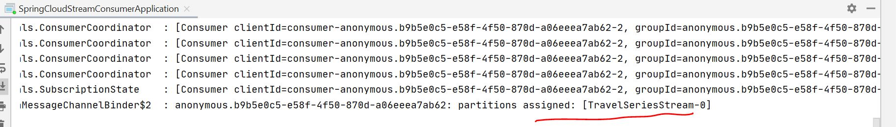
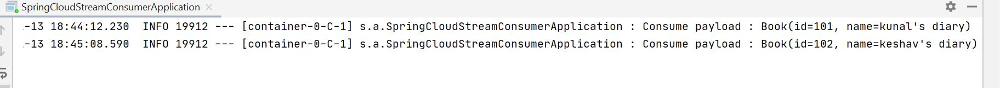

# spring-cloud-stream-publisher
C:\kafka_2.11-1.0.1\bin\windows

start zookeeper zookeeper-server-start.bat C:\kafka_2.11-1.0.1\config\zookeeper.properties

start kafkaserver kafka-server-start.bat C:\kafka_2.11-1.0.1\config\server.properties

To work with kafka, we need to create a topic.
Because the producer and consumer, both can talk to the topic.

Publisher will pull the message to topic and consumer will consume the message from topic.

Create Topic kafka-topics.bat --create --zookeeper localhost:2181 --replication-factor 1 --partitions 1 -topic TravelSeriesStream

Output: Created topic "TravelSeriesStream".

List down all available topics
kafka-topics.bat --list --zookeeper localhost:2181

Output:
TravelSeries
TravelSeriesStream
__consumer_offsets

# Put the topic name you want to use inside application.yml

spring:
  cloud:
    stream:
      bindings:
        output:
          destination: TravelSeriesStream
          
With this, my publisher will publish the Book object over the  TravelSeriesStream

Configure similar inside consumer, but instead of output, it will have input        

Run the publisher first

Post:
http://localhost:9192/publish
{
"id":101,
"name":"kunal's diary"
}

Now let's start the consumer application

Screenshot of consumer app .
You can see the topic here

Publish different books from producer
{
"id":101,
"name":"kunal's diary"
}

{
"id":102,
"name":"keshav's diary"
}

You can see the message on consumer console log:

So basically what we have done is, we created a publisher. And we specify the topicm
so that the publisher will publish the events to that specific topic.
And we created a consumer, and on the consumer we point to the same topic, so that
my consumer can subscribe to that specific topic.

SO if you observe both consumer and producer app, no where we added any single line of code for apache kafka.
Only we added the dependency. So in future, if i don't want to use kafka,
i go to pom.xml and remove kafka dependency, and can add active mq or rabit mq.
This is how, this cloud stream helps us to completely loosely coupled from our message channel, whenever we are working in distributed microservice architecture.

For help: https://www.youtube.com/watch?v=1IgvFlyEPkY&list=PLVz2XdJiJQxwoGuQb8lR-sTV26dz1SoXo&index=4

          